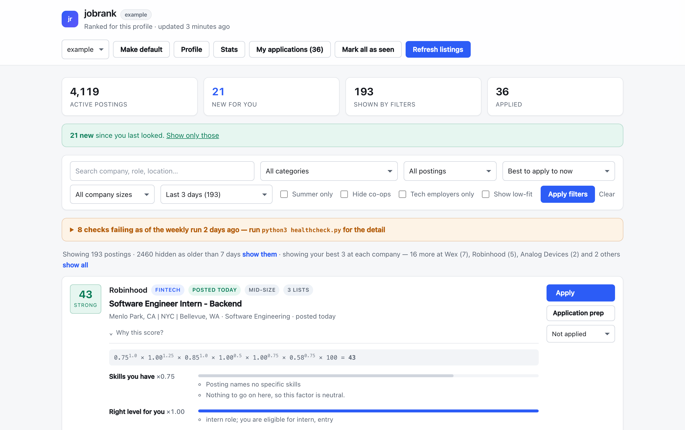

# jobrank

A local recruiting platform that reads a résumé, derives a profile from it, and
ranks live job postings by how worth applying to they are **for that person,
today** — with a measurable answer for whether the ranking is any good.

It asks for a résumé and **nothing else**. There is no "what kind of role do you
want" form, because a stated wish cannot add a skill to a résumé or make a
posting less contested. Ranking comes from what the résumé proves and what
employers are currently asking for.



Every number on that card is explained: each factor's value, the exponent the
user's own priorities gave it, and what it multiplied the score by.

---

## The problem, and why ranking is the hard part

Aggregated internship lists are long (this one indexes **4,100+ active postings
from 8 sources**) and undifferentiated. Filtering by keyword returns hundreds of
rows; sorting by date ignores fit. The useful question is *which of these is
worth an application from me, this morning* — and that depends on the person.

The earlier version of this project answered it with constants tuned to one
individual. This version derives everything from whoever uploads a résumé, and
**measures the ranking against labelled data** rather than trusting it.

## How it works

```
                                       ┌──────────────────────────┐
  résumé (PDF/DOCX/TXT) ──► extract ──►│ derived profile          │
      (the only input)                 │  skills · seniority      │
                                       │  role affinity           │
                                       └────────────┬─────────────┘
  8 job sources ──► parse ──► dedupe ──► describe ──► enrich ──► │ ─► score ─► rank ─► dashboard
                                        (job-board    (cached)   │       │
                                         APIs)                   │       └──► logs/scoring.jsonl
                     market model ───────────────────────────────┤            (per-factor record)
                  (skill rarity, per-family demand)              │
                                     embeddings ─────────────────┘
                                    (local ONNX)
                                                          golden labels ──► evaluate.py
```

**Extraction** (`jobrank/resume`, `jobrank/enrich.py`) turns documents into
structured JSON through one interface with two backends: a local Ollama model
when one is running, and a deterministic rule-based parser otherwise. Output is
JSON-schema validated and cached by content hash, so the same résumé or posting
is never analysed twice. Contact details are never extracted.

**Profile derivation** (`jobrank/profile`) computes what the scorer reads:
skills weighted by where they were demonstrated and how recently, seniority from
dated experience (internships and part-time credited at a discount, never
self-reported), and role affinity from past titles and project evidence. The
résumé is the only input.

**Descriptions** (`jobrank/descriptions.py`) fetch what each posting actually
asks for. Aggregated sources publish a title, a company and a link — measured on
the live database, **0 of 9,404 postings carried a description**, which is why
skill overlap was indistinguishable from noise. Six job boards (Greenhouse,
Lever, Ashby, SmartRecruiters, Workable, Workday) serve theirs from public,
unauthenticated endpoints; board-level endpoints return a whole employer in one
request, so **1,227 descriptions cost 952 requests**.

**Market model** (`jobrank/market.py`) learns two things from the live corpus
that no résumé can supply: how *diagnostic* each skill is (Python appears
everywhere and separates nobody; CUDA separates a great deal), and what each
role family actually demands. The hand-written evidence list for data
engineering was all specialist tools — spark, kafka, airflow, dbt — so a résumé
with Python, SQL, PostgreSQL and pandas scored the 0.05 floor for it. The corpus
puts the same résumé at 0.52.

**Scoring** (`jobrank/scoring`) composes six factors multiplicatively.

**Evaluation** (`jobrank/eval`, `evaluate.py`) scores the current configuration
against graded relevance labels and fails a regression gate.

## The scoring model

```
score = 100 × Π factorᵢ ^ wᵢ        factorᵢ ∈ [0, 1]
```

| Factor | Question | Neutral when |
|---|---|---|
| skills | Does the posting want what the résumé proves, weighted by how rare each skill is? | the posting names no skills |
| seniority | Is this the right level, and is the user eligible? | the posting states no level |
| role | Is the résumé evidence for this kind of work? | the title matches no family |
| freshness | Is it still open? Half-life varies by employer size | the posting has no date |
| semantic | Résumé-to-posting similarity, local embeddings | no embedding available |

**Why there is no preference factor.** An earlier version scored a "preference
match" and blended stated target roles into role affinity at a 0.6 share.
Measured on a real golden set, that inverted the ranking against the résumé:

| role family | résumé evidence | old score | |
|---|---|---|---|
| ML engineering | 0.713 | **0.615** | demoted — PyTorch, CUDA, computer vision |
| forward deployed | 0.393 | **0.757** | nearly doubled, for being typed into a form |
| data science | 0.528 | **0.301** | nearly halved |

Typing a job title into a box outranked years of evidence. The tool exists to
raise the odds of landing a job, and a wish does not change those odds.
Preferences now filter the view; they never move a score.

**Why multiply rather than add.** An application is worth making only when every
condition holds at once. Addition averages a fatal flaw away: a role three
levels too senior still collects most of its points from a strong title match.
Multiplication lets a near-zero on any critical factor sink the result. The
first version of this project *added* a large constant for a wanted title, and
the top of the list filled with month-old postings that could not be won.

**Why weights are exponents.** In a product, a coefficient does nothing — it
scales every score by the same ratio and reorders nothing. An exponent below 1
compresses a factor toward 1 so it still moves the result but cannot dominate;
above 1 sharpens it. The exponents are global and identical for everyone; they
were once a per-user 1–5 priority rating, which is a preference wearing a
weight's clothes — it reordered the list with no evidence it improved anything.

**Why not a learned ranker.** There is no per-user training data, and a
recruiting tool has to explain itself. Every factor here is inspectable
(`run.py --explain`), and every change is measured before it ships. A learned
model is the right tool once labels exist at scale; this structure produces the
features it would use.

**Missing data is neutral, never negative.** A posting that lists no skills is
not a posting that wants skills the user lacks.

## Does it work? Measured, not asserted

`evaluate.py` ranks a labelled pool and reports metrics beside a **random-order
baseline over the same pool**, because a metric without one means nothing.

Committed example set — a fictional infrastructure-leaning student, 118 hand
labels over a 200-posting public snapshot, reproducible on a fresh clone:

```
$ python3 evaluate.py --profile example --fixture eval/fixtures/example_postings.jsonl
```

| Metric | Ranking | Random |
|---|---|---|
| AUC | **0.848** | 0.495 |
| MRR | **1.000** | 0.491 |
| precision@10 | **0.800** | 0.265 |
| precision@20 | **0.750** | 0.256 |
| nDCG@10 | **0.768** | 0.183 |
| nDCG@20 | **0.772** | 0.200 |

Against the previous, preference-driven model on the same set: nDCG@10 rose
from 0.598 to **0.768** and nDCG@20 from 0.697 to **0.772**, while AUC fell
slightly from 0.875 to 0.848. That trade is the point — nDCG rewards putting
the *most* relevant postings highest, which is what a person acts on, whereas
part of the old AUC came from agreeing with labels that were themselves chosen
under the stated preferences being scored.

Real-world set — 36 genuine applications as positive labels over 4,130 live
postings (the labels themselves stay private):

| Metric | Ranking | Random |
|---|---|---|
| AUC | **0.706** | 0.501 |
| mean rank of a relevant posting | **1,418** of 4,792 | 2,392 |

This number went **down** when stated preferences were removed: 0.758 before,
0.706 after. It belongs here rather than in a footnote. The honest reading is
that this set cannot cleanly arbitrate the change — its labels are 36 real
applications, chosen while browsing the *old, preference-driven* ranking, so
they encode the very preferences being removed and a model that ignores them
will agree with them less. The independent graded set above, whose labels were
assigned without reference to any ranking, moved the other way (nDCG@10
0.598 → 0.768). Two sets, two directions, and the selection-biased one is the
weaker evidence.

The clean test is a labelling round on the *current* ranking
(`run.py label queue`). Until that exists, this is reported as-is.

**Ablation** — AUC lost when each factor is removed, on the real set:

| Removed | AUC | Δ |
|---|---|---|
| (none) | 0.758 | — |
| role affinity | 0.711 | **+0.047** |
| semantic | 0.715 | **+0.043** |
| seniority | 0.748 | +0.010 |
| preferences | 0.753 | +0.006 |
| skills | 0.766 | −0.007 |

This ablation is from the **previous** model and is kept because of what it
shows. Two factors carried the ranking; preference match contributed +0.006,
inside the noise, for a whole form of questions. Skill overlap was *negative* —
removing it helped — because it was matching a résumé against a seven-word
title on postings that carried no description. Those two findings are what
motivated deleting preferences and building description fetching.

### Honest limitations

- **Positive-only labels.** Applications say what was relevant, never what was
  irrelevant, so precision@k on the real set is a lower bound and AUC is the
  honest headline. `run.py label queue` labels the top of the current ranking,
  which is what turns precision into a measurement.
- **Selection bias.** Those applications were chosen while browsing an earlier
  ranking, so they over-represent what that ranking surfaced.
- **A ceiling from the data, now partly lifted.** ~1,000 postings are some
  variant of "Software Engineer Intern". With only a title there is nothing to
  tell them apart. Description fetching has raised coverage from **0% to 26%**
  of active postings; the remaining 74% are on boards that render in JavaScript
  or expose no public endpoint, and they still hit that ceiling.
- **Metrics are measured with freshness excluded**, because it changes daily
  and would make a saved baseline meaningless.
- **The example labels are synthetic**, assigned to a fictional profile to make
  the harness reproducible. They are not a user study.

## Costs nothing to run

No paid API, SDK, or key anywhere — a test asserts it. The LLM backend is a
**loopback-only** Ollama server (a non-local host raises at call time rather
than quietly sending a résumé over the network); without it, rule-based
extraction runs. Embeddings are a 67 MB ONNX model on CPU, with hashed-token
vectors as the fallback. Every external dependency degrades instead of failing.

## Getting started

```bash
git clone https://github.com/anshikhosa-sys/Internship-Tracker.git jobrank
cd jobrank
python3 -m venv .venv && .venv/bin/pip install -r requirements.txt

# A résumé is the whole setup. Nothing asks what kind of job you want.
.venv/bin/python run.py profile create --id me --resume /path/to/resume.pdf
.venv/bin/python refresh.py          # fetch, dedupe, enrich, score
.venv/bin/python app.py              # dashboard on http://127.0.0.1:5000
```

Everything else:

```bash
python3 run.py --explain <posting_id>   # why this posting scored what it did
python3 run.py describe                 # fetch real job descriptions from job boards
python3 run.py market --profile me      # what the market wants, and the gaps in your résumé
python3 run.py --stats                  # extraction usage, cache hits, coverage, timings
python3 run.py label seed --profile me  # golden labels from your own applications
python3 evaluate.py --profile me --compare   # regression gate: exits 1 on a drop
python3 healthcheck.py                  # every subsystem, PASS/WARN/FAIL
python3 tests.py && python3 browser_tests.py
```

Optional local model: `ollama pull llama3.1:8b` — extraction upgrades itself and
nothing else changes.

## Testing

**228 tests** across extraction, profile derivation, every scoring factor, the
market model, description fetching, the evaluation harness, storage and
migrations, dedupe, the dashboard, and résumé upload — plus **47 browser
checks** driving real Chromium, because two clipboard bugs once shipped while
every Python test passed. Tests never touch
the real database, profiles, caches, logs, or the network.

## What would change at 100× scale

- **Vector search.** Exact cosine over a few thousand vectors is one matrix
  multiply (~1 ms) and beats an approximate index on recall. Past ~10⁶ vectors
  this becomes FAISS (IVF/HNSW) behind the same `upsert`/`similarities` seam.
- **Scoring.** Python-per-posting is fine at 4k (about a second, cached per
  profile and data version). At millions it becomes a two-stage retrieve-then-
  rank: ANN candidate generation, then full scoring on the top few hundred.
- **Storage.** SQLite with two files (postings rebuildable, applications
  irreplaceable) is right for one machine; multi-user hosting means Postgres
  and a job queue for ingestion.
- **Labels.** With enough of them per user, the hand-composed factors become
  features for a learned ranker — and the harness here is what would prove it
  better.

## Repository layout

```
jobrank/
  config/     data only: taxonomy, company facts, scoring shape, settings
  resume/     PDF/DOCX/text readers, date parsing, rule-based extraction
  profile/    derivation from a résumé, storage, résumé diffing
  scoring/    factor functions, multiplicative engine, explanations
  market.py   skill rarity and per-family demand, learned from the live corpus
  descriptions.py  real job descriptions from free public job-board APIs
  semantic/   local embeddings, SQLite vector store
  eval/       golden labels, retrieval metrics, harness and gate
  sources/    one module per job source, behind a shared Posting contract
  web/        Flask dashboard, profile intake, stats
  ops/        healthcheck, weekly self-check, notifications, stats
```

Design history and the reasoning behind specific decisions:
[docs/design-notes.md](docs/design-notes.md). Working rules for contributors:
[CLAUDE.md](CLAUDE.md).

## License

MIT — see [LICENSE](LICENSE).
